<html>

<head>
<meta http-equiv=Content-Type content="text/html; charset=utf-8">
<meta name=Generator content="Microsoft Word 15 (filtered)">

</head>

<body bgcolor="#272727" lang=EN-US link="#E98052" vlink="#F4B69B"
style='word-wrap:break-word'>

<h2><b>Writeup – Curse of the
Pharaoh </b><b>&#127994;&#128511;&#128043;</b></h2>

<h2>Curse of the Pharaoh 1 – <i>La boule
mystère</i></h2>

Description (français)

C'est un départ pour l'Égypte, tu t'étais mis
en tête d'aller visiter les pyramides, mais dès que tu t'es approché de la
première des caractères étranges sont apparus sur ta peau, je me demande ce
qu'ils signifient...

Voir l'indice

Je me demande s'il y a une façon de regarder
les textures de plus près... / I wonder if there's a way to take a closer look
at the textures...

&nbsp;

Quand on lance le jeu, on découvre qu’on <b>incarne
une boule</b>. 
On peut se déplacer un peu dans le décor et, en observant notre surface, on
remarque qu’il y a bien quelque chose écrit dessus… mais impossible de le lire
correctement. 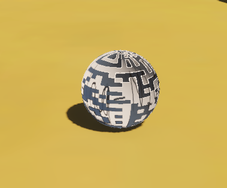

Pas besoin d’un doctorat en archéologie pour
deviner que le flag est caché dans cette texture. 
La question devient donc : comment voir cette texture <i>en dehors du jeu</i> ?

Pour ça, on va utiliser <b>AssetRipper</b>. 
C’est un logiciel qui permet d’extraire toutes les ressources d’un jeu Unity
(textures, modèles 3D, sons, etc.). 
En gros, il va nous donner accès à ce que le jeu utilise en arrière-plan.

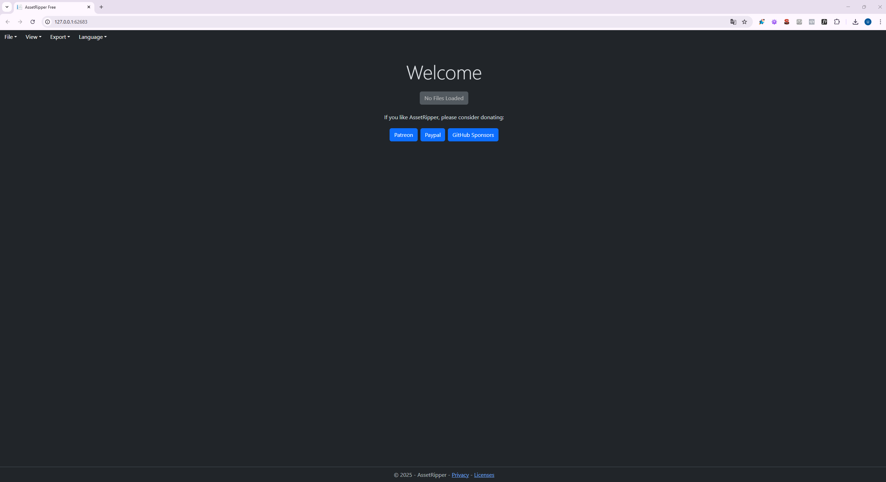Voici les étapes

On lance AssetRipper.exe.Une page web devrait
alors s’ouvrir.

En haut à gauche → <b>File </b><b>→</b><b> Load Folder</b> → on choisit
le dossier CurseOfThePharaoh.

Ensuite → <b>Export </b><b>→</b><b> Export All Files</b>.

On coche <i>Create subfolder</i> et on
sélectionne notre dossier de travail (par ex. CurseOfThePharaoh_Writeup).

On clique sur <b>Primary Content</b> → et
on laisse tourner quelques secondes.

AssetRipper génère alors un nouveau dossier
AssetRipper_export.

<b>Trouver le flag</b>

On ouvre ce dossier, on explore un peu et on se dirige vers : 
Assets → Texture2D.

Et là, on tombe sur l’image qui avait sur
notre boule. 
En l’ouvrant, on voit enfin clairement le flag qui était écrit dessus.

Premier flag trouvé, on est prêt à attaquer le
deuxième challenge.

<h2>Curse of the Pharaoh 2</h2>

Description (français)

Les hiéroglyphes ont parlé, mais un second
message reste enfoui où seulement les créateurs de cet endroit peuvent le
trouver...

Indice implicite : on va probablement devoir
regarder <b>le code du jeu</b>.

En lisant l’énoncé, je me suis dit tout de
suite : “créateurs” = développeurs, donc il faut aller voir directement dans le
code du jeu. Comme le jeu est fait avec Unity et compilé en C#, on peut
utiliser un outil appelé <b>dnSpy</b>. C’est un décompilateur qui permet
d’ouvrir et de lire le contenu des fichiers .dll (les librairies compilées du
jeu) comme si on avait accès au code source.

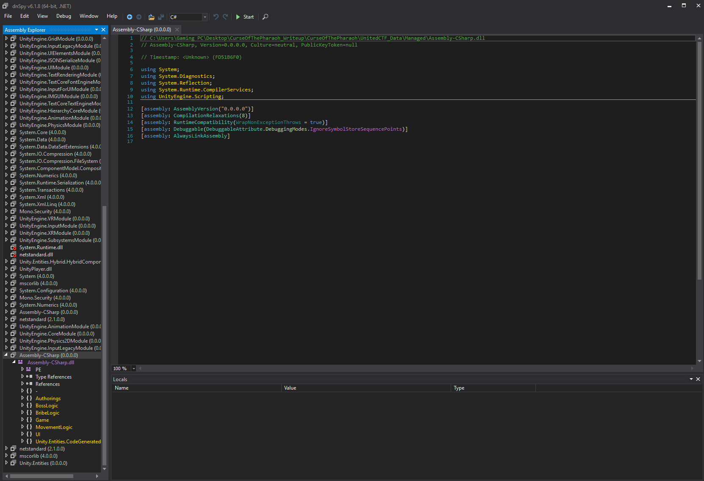Je lance donc <b>dnSpy</b>, je clique sur <i>File </i><i>→</i><i> Open</i> et j’ouvre le fichier <b>Assembly-CSharp.dll</b>,
qu’on retrouve dans le dossier CurseOfThePharaoh_Data/Managed. Une fois ouvert,
dnSpy affiche une vue en arbre avec tous les modules et classes du jeu. Les
parties en jaune attirent l’attention : ce sont souvent des endroits importants
à examiner. 

&nbsp;

En parcourant les fichiers, je finis par
tomber sur une fonction qui s’appelle <b>FlagPrintSystem</b>. Le nom est assez
explicite, ça donne tout de suite envie d’aller voir ce qu’il y a dedans.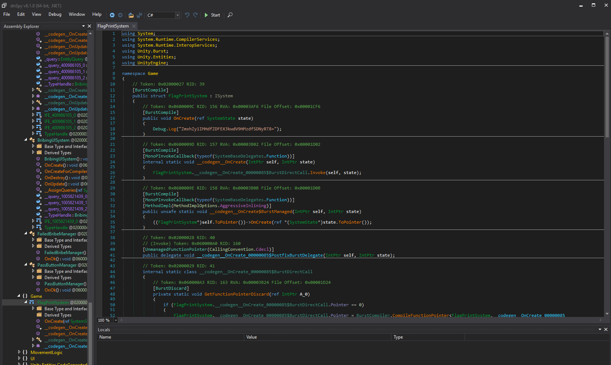

Et effectivement, à l’intérieur de cette
fonction, on découvre une chaîne de caractères étrange :

ZmxhZy1IMHdfZDFEX3kwdV9HMzdfSDNyRT8=

Elle ressemble clairement à du <b>Base64</b>. Pour vérifier, il suffit de la
décoder. On peut le faire de plusieurs manières : soit dans un terminal avec la
commande base64 -d, soit directement dans un site comme <b>CyberChef</b>, qui
est bien pratique pour tester différents types d’encodage. D’ailleurs,
CyberChef a une fonction magique : quand il détecte le type d’encodage, il
propose une petite baguette magique. Il suffit de cliquer dessus pour que le
décodage se fasse automatiquement.

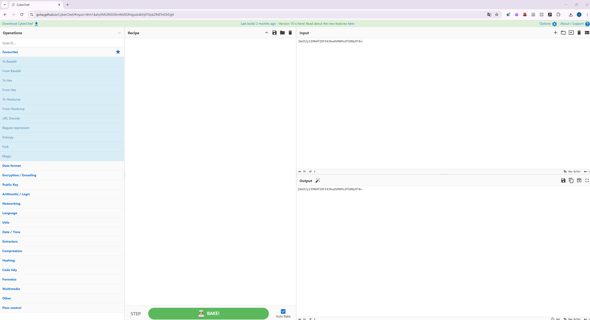 

<b>Version
alternative&nbsp;: </b>

Il existe une autre méthode, encore plus
rapide. Dans certains jeux Unity, un fichier de log est généré automatiquement
sur votre machine. Ici, on peut aller regarder dans:

%USERPROFILE%\AppData\LocalLow\DefaultCompany\UnitedCTF\Player.log

Dans ce Player.log, on retrouve aussi la
chaîne Base64 ZmxhZy1IMHdfZDFEX3kwdV9HMzdfSDNyRT8=. En la copiant et en la décodant,
on obtient le même résultat sans même avoir besoin d’ouvrir dnSpy.

Bravo, on a donc récupéré le deuxième flag ! Cette fois-ci en passant
par une analyse du code (ou par les logs si on veut la méthode rapide). On est
maintenant prêts à s’attaquer au troisième challenge. 

<h2>Curse of the Pharaoh 3</h2>

Description (français)

Mais comment passer ce garde??

On peut relancer le jeu depuis dnSpy (bouton <i>Start</i>
→ choisir l’exécutable CurseOfThePharaoh.exe) ; en se déplaçant on
croise un garde qui bloque la route vers la droite, qu’il demande un
pot-de-vin, et surtout qu’un <b>mur invisible</b> empêche le passage. L’énigme
sent la bidouille de code.

<b>Exploration et premières idées</b>

J’ouvre dnSpy et je commence à chercher où la
logique du pot-de-vin est implémentée. Après un peu d’exploration, on tombe sur
le module <b>BribingSystem / BribeLogic</b> qui gère tout l’échange. Le nom
AcceptBribe fait immédiatement penser qu’on a trouvé la bonne cible.

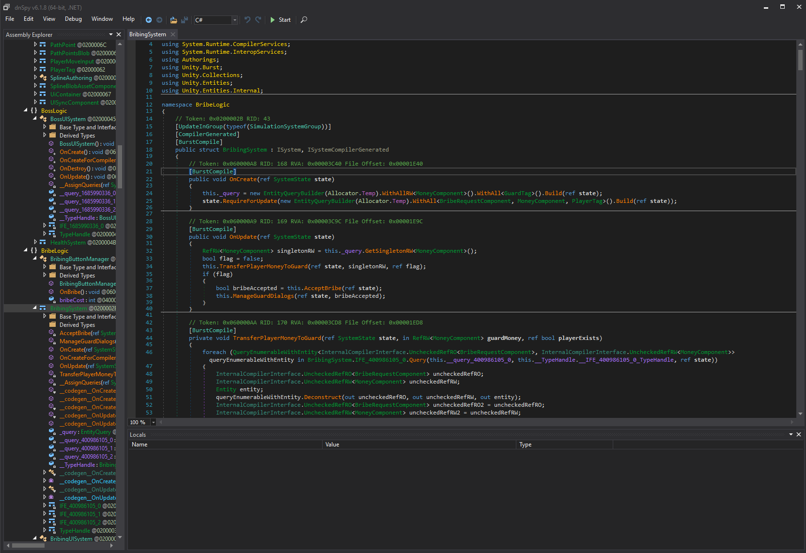

Dans AcceptBribe on repère une comparaison du
genre

item.ValueRO.Value &gt;= item2.ValueRO.Value

L’idée évidente est de forcer la condition
pour que même un petit montant passe — par exemple changer &gt;= en &lt;=. Je
tente donc d’éditer la méthode avec <b>Edit Method (C#)</b> dans dnSpy et de
recompiler.

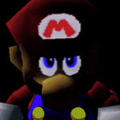Après la modification, dnSpy refuse de compiler :
erreur de compilation. J’essaie de faire la modif la plus simple possible (ne
rien changer) et la compilation plante encore — signe que ce n’est pas la
logique en elle-même qui pose problème, mais la façon dont la méthode est
attachée au système ECS (Entity Component System) ou des dépendances que cette
DLL attend.

En pratique, Unity + ECS introduisent parfois
des types ou des appels qui ne sont pas trivialement recompilables depuis dnSpy
(problèmes de signatures, d’attributs, ou d’accès à certains types liés au runtime).
Plutôt que d’acharner AcceptBribe, je parcours d’autres fonctions du même
module pour trouver quelque chose qui <b>compile proprement</b> si je l’édite.
Finalement, je découvre que <b>OnBribe()</b> se recompilent sans erreur. Bingo
: il faut donc agir via OnBribe() plutôt que AcceptBribe.

<b>Lecture de OnBribe() et stratégie finale</b>

Voici la fonction OnBribe() telle qu’on la
trouve dans le code :

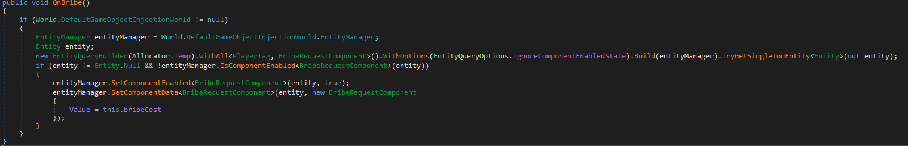

En lisant ça et le reste du module, on
comprend plusieurs choses utiles :

<ul style='margin-top:0in' type=disc>
 <li class=MsoNormal>OnBribe() est appelé quand on parle au garde
     (ou quand l’événement de don est déclenché).</li>
 <li class=MsoNormal>Le système utilise <b>ECS</b> : il interroge
     un singleton (via EntityQueryBuilder) pour récupérer un
     BribeRequestComponent.</li>
 <li class=MsoNormal>Si on parvient à récupérer ou créer/modifier
     le composant qui contient les informations sur le mur (BribeComponent /
     champ .Wall), on pourra reproduire ce que fait AcceptBribe (mettre le
     résultat à true et détruire le mur) <b>sans toucher à AcceptBribe</b>.</li>
</ul>

Donc la stratégie : au lieu d’altérer la
comparaison d’AcceptBribe, on modifie OnBribe() (qui compile) pour <b>récupérer
le BribeComponent singleton</b> et effectuer directement l’action qui supprime
le mur / marque la requête comme acceptée.

Concrètement, j’ai ajouté la récupération d’un
BribeComponent par un EntityQueryBuilder similaire à ce qui est fait dans
OnBribe() mais avec WithAll&lt;BribeComponent&gt;(), puis j’ai lu/écrit les
champs nécessaires (activer le flag de suppression du mur, ou détruire l’entité
du mur selon l’implémentation). Après recompilation, OnBribe() s’exécute en
jeu, le mur disparaît et le garde laisse passer.

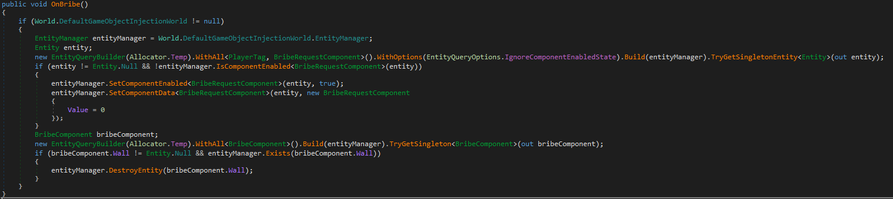

On arrive ensuite dans la zone où le flag est
affiché.

<b>Remarques pédagogiques (pour les débutants)</b>

<ul style='margin-top:0in' type=disc>
 <li class=MsoNormal><b>Pourquoi AcceptBribe a planté alors que
     OnBribe() passait ?</b> Modifier une méthode qui
     dépend fortement de types/constructeurs du runtime ECS peut provoquer des
     erreurs de signature à la recompilation. Cherche une méthode équivalente
     dans le même module qui compile proprement : patcher une méthode « plus haut
     niveau » peut suffire.</li>
 <li class=MsoNormal><b>ECS résumé rapide :</b> au lieu d’objets
     Unity classiques, le jeu manipule des <i>entities</i> et <i>components</i>
     via un EntityManager. Pour modifier le comportement, on cherche souvent le
     composant singleton qui contient l’état (ici BribeComponent) et on le
     change.</li>
 <li class=MsoNormal><b>Débogage itératif :</b> si une modif ne compile pas, ne t’obstine pas : explore d’autres
     fonctions proches et teste des modifications minimales qui compilent.
     C’est souvent plus rapide.</li>
</ul>

Bravo — troisième flag en poche. On avance
maintenant vers le dernier défi de la track.

<h2>Curse of the Pharoah 4 </h2>

Description (français)

On dirait que le pharaon a truqué le jeu en sa
faveur... Mais comment le battre?

Note : Lorsque vous l'aurez battu, le flag
apparaîtra à sa gauche.

Voir l'indice

-&nbsp;&nbsp;&nbsp;&nbsp;&nbsp;&nbsp;&nbsp;&nbsp;&nbsp;
Et si on injectait un système ECS dans le jeu...? /
What about injecting an ECS system into the game...?

-&nbsp;&nbsp;&nbsp;&nbsp;&nbsp;&nbsp;&nbsp;&nbsp;&nbsp;
L'ordre d'exécution des systèmes est important. /
The order of execution of systems is important.

<i>
Note : La solution présentée pour ce challenge repose sur une approche alternative qui n’était pas la méthode initialement prévue par la créatrice. Bien que non intentionnelle, cette solution permettait néanmoins de valider le défi lors de la compétition.
</i>

Au départ, le pharaon n’a pas l’air bien
méchant. On s’approche, on essaie de lui parler… et résultat : il nous expulse
directement de la pyramide. Visiblement, il ne va pas nous donner son flag
gratuitement.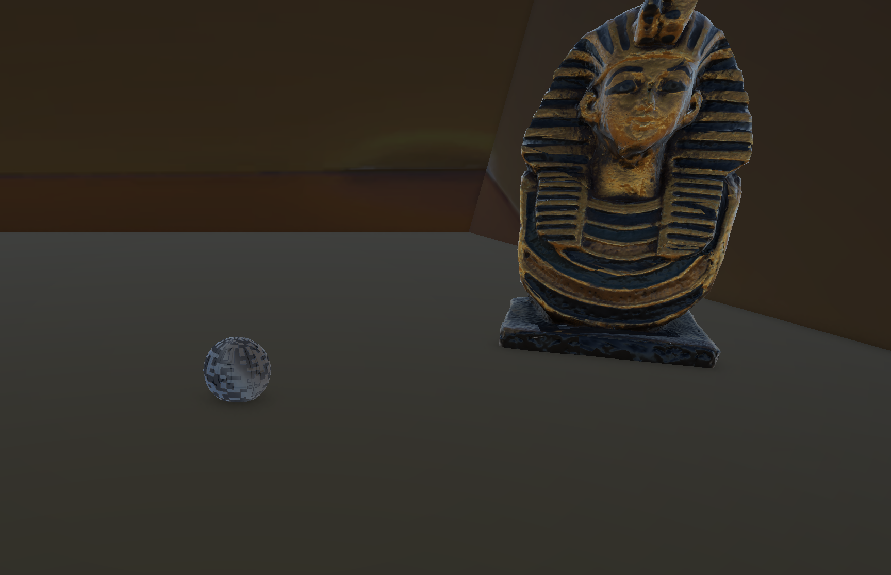

Direction <b>dnSpy</b> pour voir ce qu’il fait
exactement. En fouillant dans le module <b>BossLogic</b>, on remarque deux
parties intéressantes : un <b>BossUISystem</b> et un <b>HealthSystem</b>. En
lisant rapidement les deux, on découvre qu’il existe un <b>FlagContainer</b>
lié à l’état du boss. Avec un peu de chance, ce container contient bien le
flag, il ne resterait qu’à le forcer à s’afficher.

 

L’idée est donc de reproduire la même logique
que dans le challenge précédent (quand on a supprimé le mur du garde). Cette
fois-ci, on va devoir manipuler une entité contrôlée par le <b>HealthSystem</b>.
Si on réussit à récupérer cette entité et ses données, on peut modifier
directement le composant BossDefeatedComponent pour activer le FlagContainer et
l’afficher.

Concrètement, on crée une nouvelle requête
avec un EntityQueryBuilder, comme on l’avait fait pour le garde. Mais au lieu
de cibler PlayerTag ou BribeRequestComponent, on cible <b>BossDefeatedComponent</b>.
On stocke le résultat dans une entité (par exemple entity2). Ensuite, on
récupère les données du composant :

BossDefeatedComponent componentData =
entityManager.GetComponentData&lt;BossDefeatedComponent&gt;(entity2);

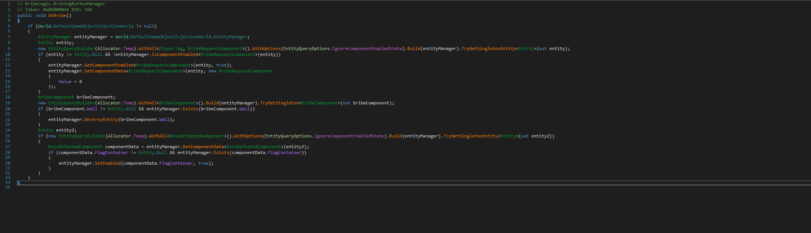On ajoute ensuite une petite vérification pour s’assurer que l’entité
n’est pas vide et qu’elle existe bien. Enfin, on modifie la valeur du
FlagContainer afin de la passer à true.

&nbsp;

&nbsp;

&nbsp;

Parfait
allons voir si le flag est présent. 

&nbsp;

Bravo ! Vous avez complété la track <b>Curse
of the Pharaoh</b>.

&nbsp;

</body>

</html>
