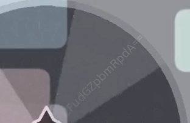
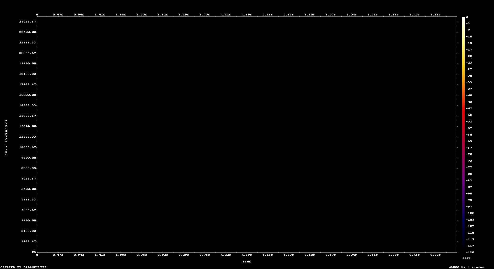

+++
draft = false
title = 'Finders Keepers'
category = 'Crypto / Forensics'
+++

> I wanna steal everything, but I don't know where it is.... maybe this video can help?

<!--more-->

> **Catégorie :** Crypto / Forensics  
> **Fichier fourni :** `finderskeepers.mp4`  
> **Flag :** `csaw{y0u_@lw@ys_kn0w_wh3r3_t0_l00k}`

## Énoncé

Le défi fournit une courte vidéo MP4. L'objectif est de récupérer plusieurs indices cachés dans la vidéo et dans son conteneur, puis de les combiner pour déchiffrer le flag.

---

## 1. Inspection visuelle de la vidéo

La première étape est simplement de regarder la vidéo attentivement.

À première vue, la vidéo ressemble surtout à une animation avec une roue qui tourne. Cependant, en regardant de plus près, **une chaîne de caractères très discrète apparaît directement sur la roue** pendant une partie de la vidéo.

En zoomant sur cette zone, on peut distinguer une chaîne encodée en Base64 :



La chaîne est :

```text
Y2FudGZpbmRpdA==
```

Elle est facile à manquer à vitesse normale à cause de sa faible opacité et de son orientation sur la roue.

On peut aussi extraire manuellement une frame de la vidéo avec `ffmpeg`, par exemple :

```bash
ffmpeg -ss 3.9 -i finderskeepers.mp4 -frames:v 1 frame.png
```

---

## 2. Décodage du premier Base64

On décode la chaîne trouvée visuellement :

```bash
echo 'Y2FudGZpbmRpdA==' | base64 -d
```

Résultat :

```text
cantfindit
```

On conserve donc :

```text
cantfindit
```

À ce stade, on ne sait pas encore exactement à quoi cette valeur va servir, mais elle ressemble fortement à une **clé**.

L'énoncé constitue également un indice :

> *I don't know where it is...*

ce qui correspond bien à **"can't find it"**.

---

## 3. Inspection du conteneur MP4

La vidéo contient donc déjà un indice visuel, mais celui-ci n'est pas suffisant pour obtenir directement le flag. Il faut également inspecter les données internes du fichier MP4.

Une méthode simple consiste à utiliser `strings` :

```bash
strings finderskeepers.mp4 | less
```

On peut également chercher les chaînes ayant la forme typique d'un Base64 :

```bash
strings finderskeepers.mp4 | grep -E '[A-Za-z0-9+/]{20,}={0,2}'
```

Parmi les données du fichier, on trouve un bloc de métadonnées **XMP/RDF** contenant notamment :

```xml
<x:xmpmeta xmlns:x='adobe:ns:meta/' x:xmptk='Image::ExifTool 13.55'>
<rdf:RDF xmlns:rdf='http://www.w3.org/1999/02/22-rdf-syntax-ns#'>
 ...
 <rdf:Description rdf:about=''
  xmlns:dc='http://purl.org/dc/elements/1.1/'>
  <dc:subject>
   <rdf:Bag>
    <rdf:li>ZXNucHtkMGNfQHl6QGdsX21uMGpfcG0zejNfZzBfbzAwc30=</rdf:li>
   </rdf:Bag>
  </dc:subject>
 </rdf:Description>
 ...
</rdf:RDF>
</x:xmpmeta>
```

La chaîne intéressante est :

```text
ZXNucHtkMGNfQHl6QGdsX21uMGpfcG0zejNfZzBfbzAwc30=
```

Elle ressemble elle aussi à du Base64.

---

## 4. Décodage du second Base64

On la décode :

```bash
echo 'ZXNucHtkMGNfQHl6QGdsX21uMGpfcG0zejNfZzBfbzAwc30=' | base64 -d
```

Résultat :

```text
esnp{d0c_@yz@gl_mn0j_pm3z3_g0_o00s}
```

Cette fois, le résultat ressemble clairement à un flag chiffré :

```text
esnp{...}
```

Le format attendu pour le challenge est :

```text
csaw{...}
```

Nous avons maintenant :

- un texte chiffré : `esnp{d0c_@yz@gl_mn0j_pm3z3_g0_o00s}` ;
- une clé potentielle trouvée dans la vidéo : `cantfindit` ;
- un préfixe connu du texte clair : `csaw{`.

---

## 5. Identifier le chiffrement

Le challenge étant classé en crypto et la clé étant alphabétique, un chiffrement de **Vigenère** est une piste naturelle.

On peut d'abord vérifier cette hypothèse grâce au préfixe connu `csaw`.

Comparons les quatre premières lettres :

```text
Texte clair    : c s a w
Texte chiffré  : e s n p
```

Les décalages sont :

| Position | Clair | Chiffré | Décalage | Lettre de clé |
|---|---|---|---:|---|
| 1 | `c` | `e` | 2 | `c` |
| 2 | `s` | `s` | 0 | `a` |
| 3 | `a` | `n` | 13 | `n` |
| 4 | `w` | `p` | 19 | `t` |

Le début de la clé est donc :

```text
cant
```

Cela confirme exactement la valeur récupérée dans la vidéo :

```text
cantfindit
```

La vidéo ne sert donc pas seulement d'ambiance ou de fausse piste : **elle contient directement la clé du Vigenère, encodée en Base64**.

---

## 6. Déchiffrement Vigenère

Il reste à déchiffrer :

```text
esnp{d0c_@yz@gl_mn0j_pm3z3_g0_o00s}
```

avec la clé :

```text
cantfindit
```

La clé doit avancer uniquement sur les caractères alphabétiques. Les chiffres, underscores, accolades et `@` restent inchangés.

Un petit script Python permet de reproduire le déchiffrement : 

*(Script généré par l'IA Gemini avec le prompt suivant : « Donne-moi un script pour déchiffrer un texte Vigenère avec la clé cantfindit et le message chiffré trouvé : esnp{d0c_@yz@gl_mn0j_pm3z3_g0_o00s} »)*

```python
ciphertext = "esnp{d0c_@yz@gl_mn0j_pm3z3_g0_o00s}"
key = "cantfindit"

result = []
j = 0

for c in ciphertext:
    if c.isalpha():
        shift = ord(key[j % len(key)]) - ord('a')
        p = (ord(c) - ord('a') - shift) % 26
        result.append(chr(p + ord('a')))
        j += 1
    else:
        result.append(c)

print(''.join(result))
```
Le déchiffrement peut aussi être vérifié en ligne sur dCode :
![[dcode_decrypt.png]]
Résultat :

```text
csaw{y0u_@lw@ys_kn0w_wh3r3_t0_l00k}
```

---

## 7. Vérification de la piste audio

La vidéo contient également une piste audio. Pour vérifier qu'elle ne cache pas un autre élément nécessaire, on peut l'extraire et examiner son spectrogramme.



Dans ce cas, l'audio ne semble pas apporter d'information supplémentaire utile à la résolution.

---

## Flag

```text
csaw{y0u_@lw@ys_kn0w_wh3r3_t0_l00k}
```

---

## Résumé de la chaîne de résolution

```text
finderskeepers.mp4
        |
        | inspection visuelle
        v
Y2FudGZpbmRpdA==
        |
        | Base64
        v
   cantfindit
        |
        |                    inspection du conteneur MP4
        |                              |
        |                              v
        |        ZXNucHtkMGNfQHl6QGdsX21uMGpfcG0zejNfZzBfbzAwc30=
        |                              |
        |                              | Base64
        |                              v
        |             esnp{d0c_@yz@gl_mn0j_pm3z3_g0_o00s}
        |                              |
        +------------ clé ------------+
                                       |
                                       | Vigenère
                                       v
                     csaw{y0u_@lw@ys_kn0w_wh3r3_t0_l00k}
```

## Outils utilisés

- lecteur vidéo / extraction de frames ;
- `ffmpeg` ;
- `strings` ;
- `grep` ;
- `base64` ;
- Python ;
- inspection des métadonnées XMP/RDF.
