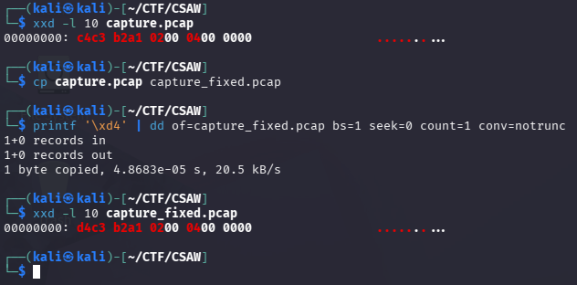
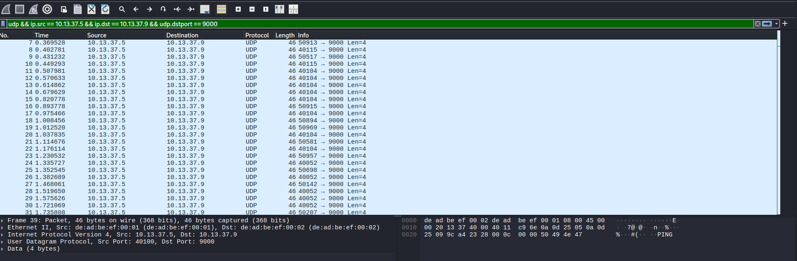
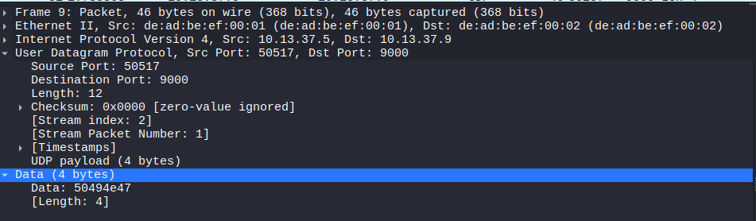
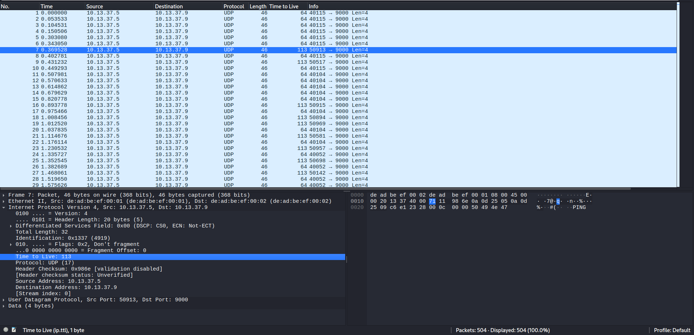
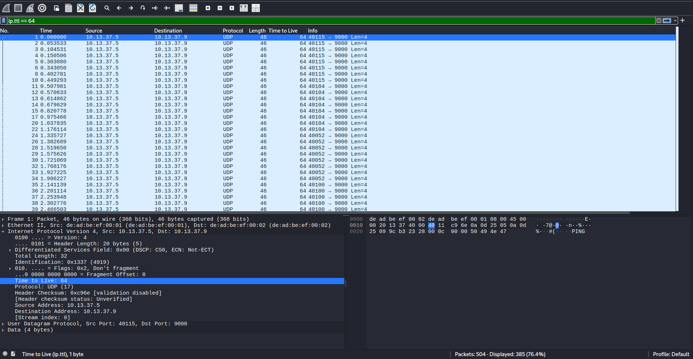
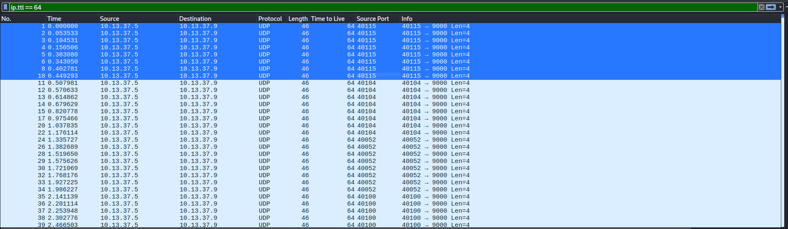
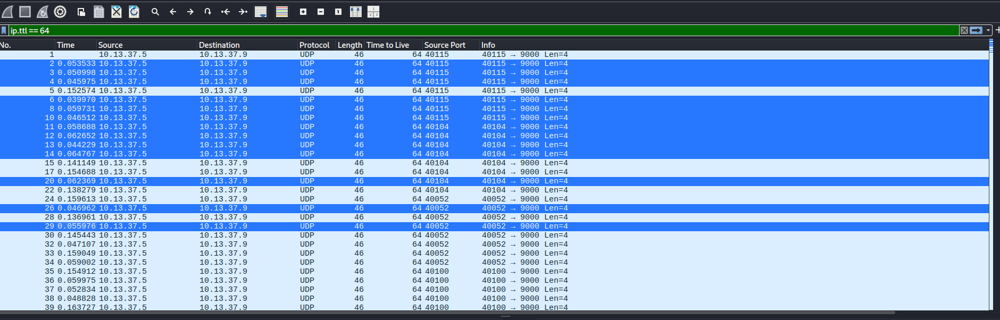
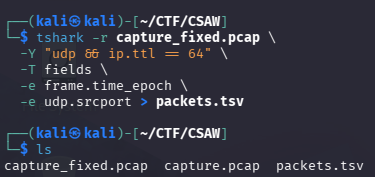

+++
draft = false
title = 'Ghost in the Machine'
category = 'Forensics'
+++

> We intercepted a host quietly beaconing out of a locked-down network. The firewall logs every byte that leaves — and every byte here is boring. Same source, same destination, the same little `PING` payload, over and over.
>
> And yet something is getting out. It's buried in the noise, it's scrambled, and the operator left just enough on the wire to unscramble it — if you know which columns to trust.
>
> Find the message.

<!--more-->

## Informations

- **Catégorie :** Forensics
- **Challenge :** Ghost in the Machine
- **Fichier fourni :** `capture.pcap`
- **Flag :** `csaw{t1m1ng_1s_3v3ryth1ng_1n_th3_s1l3nt_ch4nn3l}`

---

## Énoncé

L'énoncé indique plusieurs éléments importants :

- le contenu des paquets semble toujours identique ;
- le message est **caché dans le bruit** ;
- il est **scrambled**, donc probablement chiffré ou XORé ;
- l'indice *"which columns to trust"* suggère que l'information intéressante se trouve dans les **métadonnées des paquets** plutôt que dans leur payload.

---

# 1. Réparer le fichier PCAP 

Avant même de commencer l'analyse, un premier problème apparaît : **Wireshark refuse d'ouvrir le fichier fourni**.

L'extension `.pcap` est pourtant correcte. Le problème se trouve dans les premiers octets du fichier, c'est-à-dire dans son **magic number**.

Un fichier PCAP little-endian classique commence par :

```text
d4 c3 b2 a1
```

Or le fichier fourni commence par :

```text
c4 c3 b2 a1
```

On remarque qu'un seul octet a été modifié :

```text
c4 c3 b2 a1   <- fichier fourni
d4 c3 b2 a1   <- en-tête PCAP valide
^^
```

Cette modification suffit à empêcher Wireshark d'identifier correctement le fichier comme une capture PCAP.

Sous Kali Linux, on peut réparer directement l'en-tête avec `dd`.

## Vérifier l'en-tête original

On commence par afficher les quatre premiers octets :

```bash
xxd -l 10 capture.pcap
```

On obtient :

```text
00000000: c4c3 b2a1 0200 0400 0000 
```

Le premier octet est donc bien incorrect.

## Faire une copie avant modification

Afin de conserver le fichier original :

```bash
cp capture.pcap capture_fixed.pcap
```

Nous allons modifier uniquement `capture_fixed.pcap`.

## Corriger le premier octet avec `dd`

La commande suivante écrit la valeur hexadécimale `d4` à l'offset `0` du fichier :

```bash
printf '\xd4' | dd of=capture_fixed.pcap bs=1 seek=0 count=1 conv=notrunc
```

Explication des options :

```text
of=capture_fixed.pcap  -> fichier à modifier
bs=1                   -> travaille octet par octet
seek=0                 -> écrit à partir du premier octet
count=1                -> écrit un seul octet
conv=notrunc           -> ne tronque pas le reste du fichier
```

Il est particulièrement important d'utiliser :

```text
conv=notrunc
```

Sans cette option, `dd` pourrait tronquer le fichier après l'octet écrit.

## Vérifier la correction

On contrôle de nouveau l'en-tête :

```bash
xxd -l 10 capture_fixed.pcap
```

Cette fois, le résultat doit être :

```text
00000000: d4c3 b2a1 0200 0400 0000 
```



Le fichier peut maintenant être ouvert normalement dans Wireshark :

```bash
wireshark capture_fixed.pcap
```

On peut également vérifier rapidement que Wireshark/TShark reconnaît bien la capture :

```bash
capinfos capture_fixed.pcap
```

ou :

```bash
tshark -r capture_fixed.pcap -c 5
```

Cette altération de l'en-tête constitue donc une première petite étape d'**anti-forensics** : le contenu de la capture reste exploitable, mais sa signature a été volontairement modifiée pour empêcher son ouverture directe.

---

# 2. Inspection initiale de la capture

On ouvre `capture_fixed.pcap` dans Wireshark.

La capture contient des paquest, tous en UDP.

On observe essentiellement le même trafic :

- source : `10.13.37.5`
- destination : `10.13.37.9`
- port destination UDP : `9000`
- payload : `PING`

Un filtre permettant d'isoler ce trafic est :

```text
udp && ip.src == 10.13.37.5 && ip.dst == 10.13.37.9 && udp.dstport == 9000
```

Tous les paquets contiennent seulement quatre octets applicatifs :

```text
50 49 4e 47
```

soit :

```text
PING
```

Le payload ne contient donc manifestement pas directement le flag.



---

# 3. Vérification du payload `PING`

Pour confirmer que les données applicatives sont bien identiques :

1. sélectionner un paquet ;
2. dans le panneau **Packet Details**, développer **User Datagram Protocol** ;
3. regarder la section **Data** ;
4. dans le panneau hexadécimal, on retrouve `50 49 4e 47`, soit `PING`.

On peut répéter l'opération sur plusieurs paquets : leur contenu applicatif reste identique.

Cela correspond exactement au leurre décrit dans l'énoncé : *"the same little `PING` payload, over and over"*.



---

# 4. Recherche de champs qui varient

Puisque le payload ne change pas, il faut examiner les colonnes et les champs des en-têtes.

Deux champs deviennent particulièrement intéressants :

- le **TTL IPv4** ;
- le **port source UDP**.

## Ajouter le TTL comme colonne dans Wireshark

Pour afficher le TTL directement dans la liste des paquets :

1. sélectionner un paquet ;
2. développer **Internet Protocol Version 4** ;
3. trouver **Time to Live** ;
4. clic droit sur `Time to Live` ;
5. choisir **Apply as Column**.

On remarque alors deux populations :

```text
TTL = 64
TTL = 113
```

Dans la capture :

```text
TTL 64  : 385 paquets
TTL 113 : 119 paquets
```

Les paquets avec `TTL = 113` ont des ports source qui ressemblent à du bruit aléatoire, principalement dans la plage `50000+`.

Les paquets avec `TTL = 64`, en revanche, ont une structure beaucoup plus régulière.



Le filtre suivant permet donc de conserver uniquement les paquets intéressants :

```text
ip.ttl == 64
```

Il reste **385 paquets**.



---

# 5. Le port source cache une clé

On examine ensuite les ports source UDP.

## Ajouter le port source comme colonne

1. sélectionner un paquet ;
2. développer **User Datagram Protocol** ;
3. clic droit sur **Source Port** ;
4. choisir **Apply as Column**.

Avec le filtre :

```text
ip.ttl == 64
```

les premiers ports source ressemblent à ceci :

```text
40115
40115
40115
40115
40115
40115
40115
40115

40104
40104
40104
40104
40104
40104
40104
40104

40052
40052
40052
40052
40052
40052
40052
40052

40100
...
```

Chaque valeur apparaît par groupes de **8 paquets**.

Cela ressemble fortement à un encodage ASCII.

En soustrayant `40000` :

| Port source | Port - 40000 | ASCII |
|---:|---:|:---:|
| 40115 | 115 | `s` |
| 40104 | 104 | `h` |
| 40052 | 52 | `4` |
| 40100 | 100 | `d` |
| 40111 | 111 | `o` |
| 40119 | 119 | `w` |

On obtient :

```text
sh4dow
```

Puis le motif recommence.

La capture nous fournit donc elle-même une clé répétée :

```text
sh4dowsh4dowsh4dow...
```

C'est probablement ce que l'énoncé veut dire par :

> *"the operator left just enough on the wire to unscramble it"*



---

# 6. Le message est caché dans le timing

Il reste à trouver les données à déchiffrer.

L'indice principal est le comportement temporel des paquets.

Après avoir filtré :

```text
ip.ttl == 64
```

on peut demander à Wireshark d'afficher le temps écoulé depuis le **paquet affiché précédent**.

Dans Wireshark :

```text
View
  → Time Display Format
    → Seconds Since Previous Displayed Packet
```

> Il est important d'utiliser **Previous Displayed Packet** et non simplement **Previous Captured Packet**.
>
> Les paquets `TTL = 113` ont été filtrés et constituent du bruit. Nous voulons donc mesurer les intervalles entre les paquets `TTL = 64` seulement.

La colonne **Time** montre alors deux groupes de délais très distincts.

Exemples observés :

```text
0.053533
0.050998
0.045975
0.152574
0.039970
0.059731
0.046512
0.058688
...
```

On constate que les délais sont répartis autour de deux plages :

```text
environ 0.035 à 0.080 seconde
environ 0.120 à 0.165 seconde
```

On peut donc choisir `0.100 s` comme seuil :

```text
delta < 0.100 s  → 0
delta > 0.100 s  → 1
```

Les intervalles deviennent ainsi un flux binaire.

Par exemple :

```text
0.053533 → 0
0.050998 → 0
0.045975 → 0
0.152574 → 1
...
```

Il s'agit d'un **covert timing channel** : les données ne sont pas envoyées dans le payload, mais dans le délai entre les paquets.



---

# 7. Pourquoi y a-t-il 385 paquets utiles ?

Après filtrage sur :

```text
ip.ttl == 64
```

on obtient **385 paquets**.

Un délai est mesuré **entre deux paquets**.

Avec 385 paquets, on obtient donc :

```text
385 - 1 = 384 intervalles
```

Ces 384 intervalles représentent 384 bits :

```text
384 / 8 = 48 octets
```

Le premier paquet sert donc de référence temporelle, puis chaque paquet suivant permet de mesurer un nouveau bit.

---

# 8. Reconstruction du ciphertext

On convertit chaque intervalle en bit avec le seuil de 100 ms :

```text
< 100 ms → 0
> 100 ms → 1
```

On regroupe ensuite les bits par groupes de 8, en ordre **MSB first**.

On obtient 48 octets :

```text
10 1b 55 13 14 03 42 05
05 0a 08 28 42 1b 6b 57
19 44 01 11 40 0c 5e 19
14 37 05 0a 30 03 1b 5b
6b 17 5e 1b 40 06 40 3b
0c 1f 47 06 5a 57 03 0a
```

Ces données ne sont toujours pas directement lisibles, ce qui correspond au mot *"scrambled"* de l'énoncé.

---

# 9. Déchiffrement avec la clé des ports source

Pour chaque groupe de huit bits, le port source du paquet servant de départ à l'intervalle encode le caractère de clé associé.

Les groupes donnent :

```text
s h 4 d o w s h 4 d o w ...
```

soit la clé répétée :

```text
sh4dow
```

On effectue alors un XOR entre les 48 octets du ciphertext et le flux de clé.

Principe :

```text
plaintext[i] = ciphertext[i] XOR key[i]
```

avec :

```text
key = sh4dowsh4dowsh4dow...
```

Le résultat est :

```text
csaw{t1m1ng_1s_3v3ryth1ng_1n_th3_s1l3nt_ch4nn3l}
```

---

# 10. Script de résolution

La méthode peut être automatisée avec `tshark`.

## Extraction des timestamps et ports source

```bash
tshark -r capture_fixed.pcap \
  -Y "udp && ip.ttl == 64" \
  -T fields \
  -e frame.time_epoch \
  -e udp.srcport > packets.tsv
```
Apercu dans le terminal :



Le fichier `packets.tsv` contient alors, pour chaque paquet utile :

```text
timestamp    source_port
```

On peut ensuite reconstruire le message avec Python :

*Le script ci-dessous a été généré par l'IA Gemini à partir du prompt suivant puis modifié manuellement ensuite :*

> « J’ai extrait les paquets TTL=64 d’un PCAP dans packets.tsv avec le timestamp et le port source UDP les intervalles entre paquets semblent encoder des bits ce que je veux dire c'est : moins de 100 ms = 0, plus de 100 ms = 1. Il y a 8 bits par caractère.
> Le port source reste identique pendant chaque groupe de 8 paquets et semble encoder une clé avec quelque chose du style : #port - 40000 = valeur ASCII.
> Peux-tu me faire un script Python qui reconstruit les octets à partir du timing, récupère la clé depuis les ports source, puis XOR les deux pour afficher le message final ? »

```python
rows = []

with open("packets.tsv", "r") as f:
    for line in f:
        timestamp, sport = line.strip().split("\t")
        rows.append((float(timestamp), int(sport)))

bits = []
key_stream = []

for i in range(len(rows) - 1):
    current_time, current_sport = rows[i]
    next_time, _ = rows[i + 1]

    delta = next_time - current_time

    bits.append(0 if delta < 0.100 else 1)

ciphertext = bytearray()
key = []

for i in range(0, len(bits), 8):
    chunk = bits[i:i + 8]

    value = 0
    for bit in chunk:
        value = (value << 1) | bit

    ciphertext.append(value)

    # Les 8 paquets associés au byte utilisent le même port source
    ports = [rows[j][1] for j in range(i, i + 8)]

    assert len(set(ports)) == 1

    key.append(chr(ports[0] - 40000))

key_stream = "".join(key)

print(f"[+] Key stream: {key_stream}")
print(f"[+] Ciphertext: {ciphertext.hex()}")

plaintext = bytes(
    byte ^ ord(key_stream[i])
    for i, byte in enumerate(ciphertext)
)

print(f"[+] Plaintext: {plaintext.decode()}")
```

Sortie :

```text
[+] Key stream: sh4dowsh4dowsh4dowsh4dowsh4dowsh4dowsh4dowsh4dow
[+] Plaintext: csaw{t1m1ng_1s_3v3ryth1ng_1n_th3_s1l3nt_ch4nn3l}
```

---

# 11. Flag

```text
csaw{t1m1ng_1s_3v3ryth1ng_1n_th3_s1l3nt_ch4nn3l}
```

---

# Conclusion

Ce challenge utilise plusieurs couches de dissimulation.

Le payload UDP est volontairement inutile :

```text
PING
```

Une partie des paquets est ensuite ajoutée comme bruit et peut être identifiée grâce au TTL :

```text
TTL 113 → bruit
TTL 64  → canal utile
```

Les deux véritables canaux cachés sont ensuite :

```text
Port source UDP → clé XOR
Timing          → ciphertext
```

Le port source encode la clé en utilisant :

```text
source_port - 40000 = valeur ASCII
```

ce qui révèle :

```text
sh4dow
```

Les délais entre les paquets encodent quant à eux des bits :

```text
court → 0
long  → 1
```

Une fois les bits regroupés par octets, il suffit d'effectuer un XOR avec la clé répétée pour récupérer le flag.
