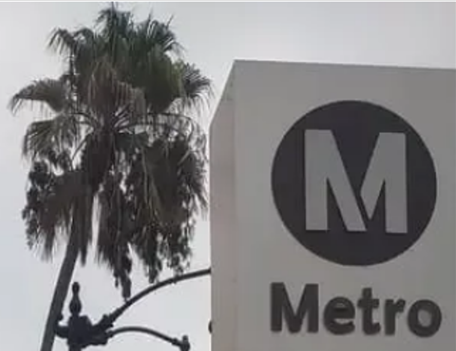

+++
draft = false
title = 'Two Marks, One Score'
category = 'OSINT'
+++

<!--more-->

## Énoncé

Le challenge fournit deux images de surveillance apparemment sans rapport :

1. un détail architectural d'un bâtiment monumental ;
2. un panneau avec un grand logo `M`, des palmiers et du mobilier urbain.

L'énoncé indique que les deux coordonnées figuraient dans le *travel manifest* de la cible et demande de déterminer **quelle opération était en préparation**. La réponse finale est décrite comme :

> “the identifier high in the sky on the day of the operation”

Format :

```text
csaw{ANSWERHERE}
```

## 1. Identification de la première image


La première image montre des éléments architecturaux caractéristiques de **Venise**, autour de la **Piazza San Marco** : architecture monumentale vénitienne, Campanile et bâtiments du complexe de la place Saint-Marc.

Cette localisation est particulièrement intéressante car **Piazza San Marco est un lieu de tournage de _The Italian Job_ (2003)**.

Sources : *Informations trouvées grâce à l'intelligence artificielle Gemini 3.8 Flash.*

- Kinoafisha — lieux de tournage de _The Italian Job_ :  
  https://www.kinoafisha.info/en/movies/5411/locations/
- L2TC — lieux de tournage, notamment Place Saint-Marc :  
  https://www.l2tc.com/cherche.php?annee=2003&exact=oui&titre=Braquage+%C3%A0+l%27italienne
- Hotel Arcadia Venice — lieux vénitiens du film :  
  https://hotelarcadia.net/exhibition/italian-job-2003-locations-venice/

  *Informations trouvées grâce à l'intelligence artificielle Gemini 3.8 Flash.*

## 2. Identification de la seconde image


La seconde image montre clairement le logo **Metro** de Los Angeles, avec un environnement compatible avec Hollywood.

Le recoupement devient très fort : _The Italian Job_ (2003) utilise plusieurs lieux de Los Angeles liés au Metro et à **Hollywood & Highland**. Les scènes de poursuite du film passent notamment par le métro de Los Angeles et le secteur Hollywood/Highland.

Sources : *Informations trouvées grâce à l'intelligence artificielle Gemini 3.8 Flash.*

- Kinoafisha — liste notamment `Metro Station, Hollywood & Highland Center` :  
  https://www.kinoafisha.info/en/movies/5411/locations/
- Article / synthèse sur le tournage du film et la séquence Hollywood & Highland :  
  https://en.wikipedia.org/wiki/The_Italian_Job_(2003_film)

À ce stade, les deux images convergent vers le même film :

```text
Piazza San Marco, Venice
          +
Los Angeles Metro / Hollywood
          ↓
The Italian Job (2003)
```

## 3. Interprétation de « l'opération »

Le film met en scène un braquage initial en Italie, puis une opération à Los Angeles. Le scénario contient aussi exactement le type d'élément évoqué par le challenge : un **« man on the inside »**, Steve, qui trahit l'équipe.

La piste du challenge consiste donc à identifier l'élément aérien utilisé pendant l'opération de Los Angeles.

## 4. L'hélicoptère

Dans le film, Steve utilise un hélicoptère pour suivre l'or et la progression de Charlie et de son équipe.

La source décisive est **Internet Movie Plane Database (IMPDb)**. Sa fiche consacrée à _The Italian Job (2003)_ identifie l'appareil comme :

```text
MD Helicopters MD 500
Used by Steve to keep track of his gold and follow Charlie.
False Reg. N723KP.
```

Source :

- IMPDb — _The Italian Job (2003)_ :  
  https://www.impdb.org/index.php/The_Italian_Job_%282003%29

Le détail `False Reg.` est important : `N723KP` est une immatriculation utilisée à l'écran pour le film, pas nécessairement l'immatriculation réelle de l'appareil de tournage.

Cela a constitué une fausse piste pendant la résolution : il est tentant de rechercher le véritable N-number historique de l'hélicoptère. Or le challenge attendait **l'identifiant visible dans l'univers de l'opération**, donc `N723KP`.

## 5. Vérification contextuelle du tournage aérien

Une source officielle de la ville de Pasadena confirme que Paramount préparait des prises de vues aériennes pour _The Italian Job_ en novembre 2002, avec des hélicoptères.

Le rapport du City Council du 7 octobre 2002 précise que Paramount souhaitait filmer des plans aériens entre midi et 18 h le **19 novembre 2002**, ou un jour ultérieur en cas de report.

Source officielle :

- City of Pasadena — Agenda Report, 7 octobre 2002 :  
  https://ww2.cityofpasadena.net/2002%20agendas/Oct_07_02/7B2.pdf

Cette source n'est pas nécessaire pour extraire le flag, mais elle confirme que la piste « high in the sky » est cohérente avec la production du film.

## 6. Vérification des images : métadonnées et stéganographie

Avant de conclure que le challenge était purement visuel/OSINT, les deux PNG ont également été inspectés pour rechercher un éventuel *travel manifest* caché :

- EXIF / métadonnées PNG ;
- chunks `tEXt`, `zTXt`, `iTXt` ;
- données ajoutées après `IEND` ;
- chaînes ASCII ;
- canal alpha ;
- bit planes / LSB sur les canaux RGB.

Aucun payload cohérent n'a été trouvé. Les images servent donc principalement de **points de pivot géographiques**, plutôt que de conteneurs stéganographiques.

## 7. Flag

L'identifiant recherché est :

```text
N723KP
```

### Flag final

```text
csaw{N723KP}
```

## Sources web utilisées

| Site | Utilité |
|---|---|
| https://www.kinoafisha.info/en/movies/5411/locations/ | Corrélation des lieux de tournage : Venise, Hollywood/Highland, Metro |
| https://www.l2tc.com/cherche.php?annee=2003&exact=oui&titre=Braquage+%C3%A0+l%27italienne | Confirmation de la Place Saint-Marc comme lieu de tournage |
| https://hotelarcadia.net/exhibition/italian-job-2003-locations-venice/ | Confirmation visuelle/contextuelle des scènes vénitiennes |
| https://www.impdb.org/index.php/The_Italian_Job_%282003%29 | Identification du MD 500 et surtout de `N723KP` |
| https://ww2.cityofpasadena.net/2002%20agendas/Oct_07_02/7B2.pdf | Document officiel confirmant le tournage aérien de _The Italian Job_ |
| https://en.wikipedia.org/wiki/The_Italian_Job_(2003_film) | Contexte général et tournage à Hollywood/Highland / LA Metro |

## Résumé de la chaîne OSINT

```text
Image 1
  ↓
Piazza San Marco, Venice
  ↓
lieu de tournage de The Italian Job (2003)

Image 2
  ↓
Los Angeles Metro / Hollywood
  ↓
autre lieu de tournage de The Italian Job (2003)

Les deux pivots convergent
  ↓
The Italian Job (2003)
  ↓
Steve suit l'équipe depuis un MD 500
  ↓
IMPDb : false registration N723KP
  ↓
csaw{N723KP}
```
