+++
draft = false
title = 'The Vantage Job'
category = 'Misc/OSINT'
+++

<!--more-->

# Write-up : The Vantage Job (CSAW CTF)

## Informations

- **Catégorie :** OSINT/Misc
- **Challenge :** The Vantage Job
- **Fichiers fournis :** `evidence_01.pdf`, `evidence_02.txt`
- **Flag :** `csaw{cr0ss_pl4tf0rm_carel3ssness}`

## Introduction

Ce défi OSINT reposait sur une longue chaîne d'indices répartis entre plusieurs fichiers et plusieurs plateformes.

Le challenge commence avec deux fichiers, `evidence_02.txt` et `evidence_01.pdf`. À partir de ceux-ci, il faut découvrir une commande cachée, interagir avec un bot Discord, identifier le pseudo `ferryman_vt`, puis suivre ses traces à travers plusieurs services jusqu'au flag final.

---

## 1. Premier indice : `evidence_02.txt`

Le fichier `evidence_02.txt` contient seulement quatre lignes :

```text
Paper keeps what paper hides,
pale as breath on frosted glass.
Not empty only patient,
waiting for the light to pass.
```

Le texte insiste sur plusieurs idées :

- **Paper** : probablement une référence au PDF fourni avec le challenge ;
- **pale as breath on frosted glass** : quelque chose de très pâle ou presque invisible ;
- **Not empty** : le document qui paraît vide ne l'est probablement pas ;
- **waiting for the light to pass** : il faut jouer avec l'affichage, le contraste ou la luminosité.

Cela nous pousse donc à examiner plus attentivement `evidence_01.pdf`.

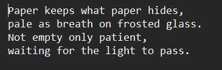

---

## 2. Texte caché dans `evidence_01.pdf`

À première vue, le PDF semble pratiquement vide. Mais on apercoit très légèremment du texte un tout petit peu plus foncé sur le fond blanc. 
En prenant une capture d'écran, et en utilisant un [outil en ligne ](https://onlinepngtools.com/change-png-color) pour modifier les couleurs d'un PNG on obtient ce texte :

```text
A bot has no thumb, no whorls, no line,
yet it wears one word as a secret sign.
Whisper it quiet, not loud, not seen --
slash the fingerprint, and it'll know what you mean.
```
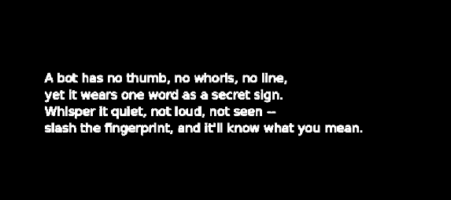

Le dernier vers du poème (ou ce qui s'y rapproche) nous donne directement une commande :

```text
/fingerprint
```

Un autre détail intéressant dans les métadonnées du PDF était son titre :

```text
Meridian Case File - The Vantage Job
```

Le nom **Vantage Job** réapparaîtra plus tard dans le challenge.

---

## 3. Le bot Discord et `/fingerprint`

Nous avons donc une commande, mais où l'utiliser ?

```text
/fingerprint
```

J'ai cherché sur quoi on pouvait avoir des commandes et des bots et j'ai tout de suite fait un lien avec Discord. On s'apercoit alors en regardant les membres du Discord 
qu'un utilisateur du nom de ```ferryman_vt``` est une app. 


En engageant une discussion privée avec, la commande ```/fingerprint```retourne ceci :

```text
Clever, aren't you… a bot with no face…
a name's a name, wherever it's seen.
Look twice at the one who's typing this line —
he answers to it everywhere, all the time.
```

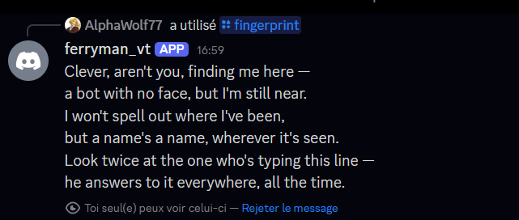

Le message nous invite clairement à regarder **le compte qui envoie le message** et surtout son nom.

En inspectant le profil du bot, nous trouvons :

```text
ferryman_vt
```

Le suffixe Discord visible était également :

```text
ferryman_vt#2936
```

La phrase :

```text
a name's a name, wherever it's seen
```

suggère que le même nom d'utilisateur est réutilisé sur plusieurs plateformes.

Notre pivot OSINT devient donc :

```text
ferryman_vt
```

---

## 4. Énumération du pseudo avec WhatsMyName

Nous utilisons [**WhatsMyName**](https://whatsmyname.app/) pour rechercher :

```text
ferryman_vt
```

On a 2 résultats, avec des profils bien réels et qui ont été créés autour du début du CTF.

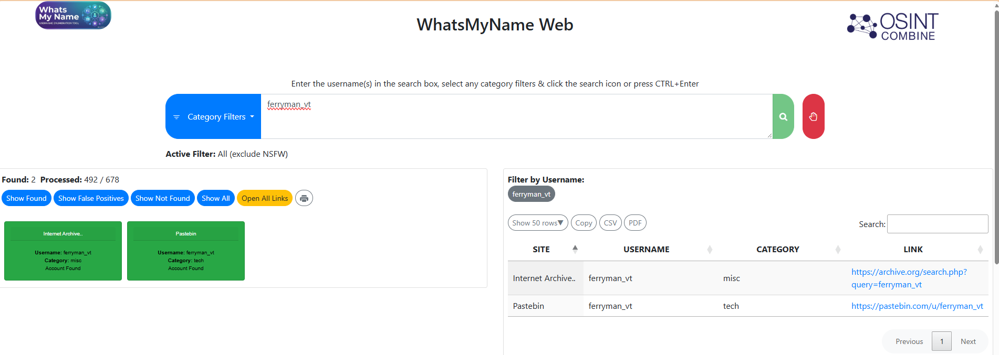

Un résultat particulièrement suspect est :

```text
https://pastebin.com/u/ferryman_vt
```

Le compte Pastebin a été créé environ un jour avant le CTF, mais ne contient aucun paste public.

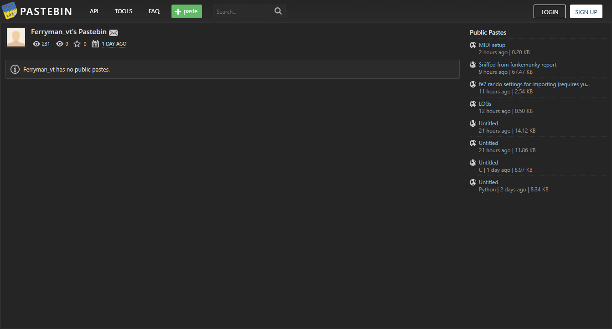

Pastebin ne donne encore rien directement, mais confirme que le pseudo est bien utilisé récemment.

---

## 5. Découverte du compte Instagram

Nous trouvons ensuite un compte Instagram utilisant également `ferryman_vt`. Cette information à été trouvée directement depuis le navigateur de recherche.

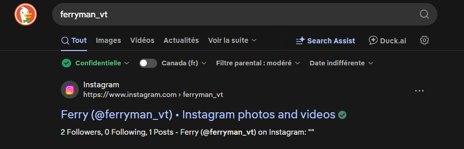

Il n'y a qu'un post qui contient l'image d'une horloge ainsi que le texte suivant :

```text
Time moves quiet on a piece that's sold,
Only the patient hear the story told.
Careful hands once held a heavier case,
Keep your questions closer, just in case.
Far from cameras, close to trust,
Every ledger balances, every debt discussed.
Reach for what's reflected, not what's said
Read the letters leading, straight ahead.
-X
```

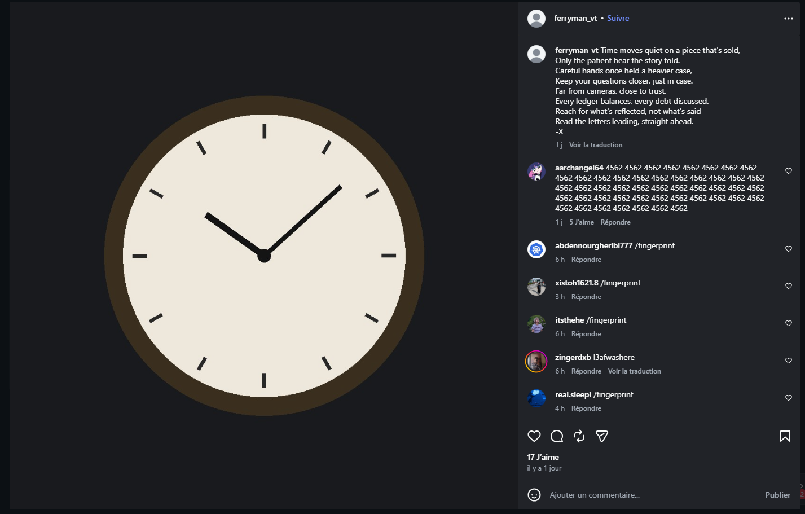

La dernière ligne donne l'instruction :

```text
Read the letters leading
```

Nous prenons donc les premières lettres de chaque ligne :

```text
T
O
C
K
F
E
R
R
```

Ce qui donne :

```text
TOCKFERR
```

À ce stade, cela ressemble clairement à un nouveau nom d'utilisateur.

---

## 6. Le commentaire `4562`

Sous le post Instagram se trouve un commentaire très inhabituel :

```text
4562 4562 4562 4562 ...
```

Le commentaire a été publié par une personne liée à NYU, l'organisation derrière CSAW, ce qui le rend particulièrement suspect.

Une interprétation possible consiste à séparer chaque bloc en deux valeurs ASCII décimales :

```text
45 62
```

Ce qui donne :

```text
45 = -
62 = >
```

Donc :

```text
4562 -> ->
```

Le commentaire agit ainsi comme une longue série de flèches qui nous incite à poursuivre la chaîne.

---

## 7. Pivot vers X / Twitter

Nous trouvons ensuite un compte X correspondant à `ferryman_vt`.

Aucun post, seulement un abonné :

```text
@saatviks28
```

Par contre en se penchat sur les abonnements de ce compte on trouve des informations très pertinentes :

Deux comptes dont nous n'avions pas connaissance avant : 

```text
@timepieces_ferr
@tockferr
```

Bingo ! Un des comptes correspond exactement à l'acrostiche du poème Instagram :

```text
TOCKFERR
```

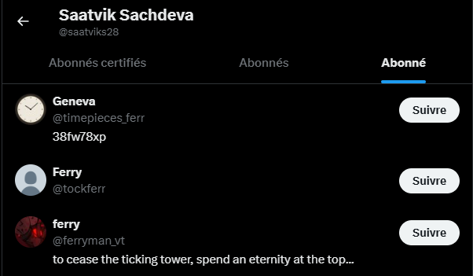

Le compte `@tockferr`, nommé **Ferry**, contient plusieurs publications récentes :

```text
Thursday well spent. 🍊
(yes, I'm the same everywhere — try harder)
```

```text
Some of us just collect. Some of us collect quietly.
```

```text
New piece landed today. Not for sale. Not yet.
```

```text
Sold a dial, kept the case, some things you just can't replace.
```

```text
Steel and glass, a patient face, ticking softly, keeping pace.
```

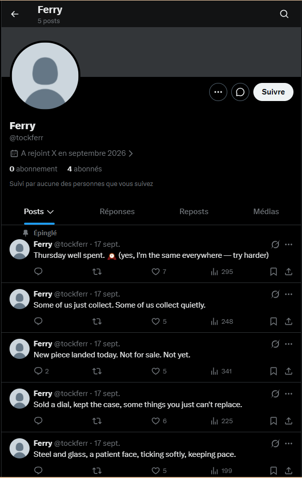

Le compte confirme que nous sommes bien dans une chaîne de comptes réutilisant les mêmes thèmes et identités.

---

## 8. Le compte Geneva

N'oublions pas qu'il y a un autre compte !

```text
Geneva
@timepieces_ferr
```

Sa photo de profil est la **même horloge** que celle utilisée dans le post Instagram.

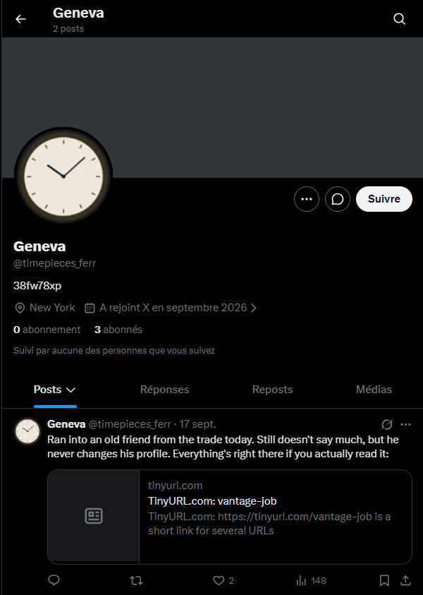

La bio du compte contient uniquement une chaîne étrange :

```text
38fw78xp
```

Geneva publie également :

```text
Ran into an old friend from the trade today.
Still doesn't say much, but he never changes his profile.
Everything's right there if you actually read it:
```

Le post contient le lien :

```text
https://tinyurl.com/vantage-job
```

Ce TinyURL redirige vers le profil `@tockferr`.

Le choix de `vantage-job` est particulièrement intéressant puisque le PDF du début avait pour titre :

```text
Meridian Case File - The Vantage Job
```

Geneva répond également au tweet de Ferry :

```text
New piece landed today. Not for sale. Not yet.
```

avec un GIF :

```text
It's all coming together.
```

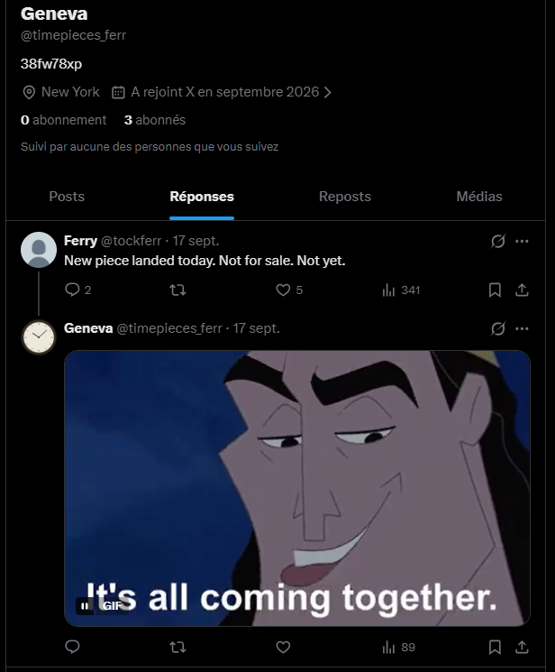

---

## 9. Utilisation de `38fw78xp`

Le tweet de Geneva nous montre explicitement l'utilisation de **TinyURL**.

Sa bio contient :

```text
38fw78xp
```

Nous testons donc :

```text
https://tinyurl.com/38fw78xp
```

Cette fois, le lien redirige vers :

```text
https://paste.d4rk4shes.com/
```

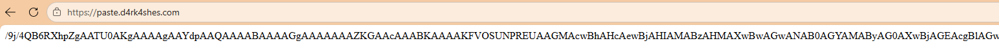

Le site ne contient qu'une très longue ligne commençant par :

```text
/9j/4QB6RXhpZg...
```

Le préfixe `/9j/` est typique d'une image JPEG encodée en **Base64**.

---

## 10. Décodage du Base64

Nous copions la chaîne dans un fichier puis la décodons :

```bash
base64 -d texte.txt > image.jpg
```

Le résultat est une image JPEG représentant un faux reçu de vente.

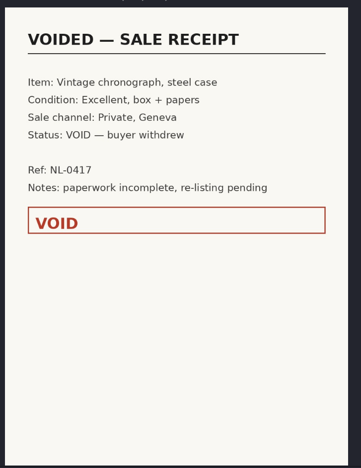

On peut notamment y lire :

```text
VOIDED — SALE RECEIPT

Item: Vintage chronograph, steel case
Condition: Excellent, box + papers
Sale channel: Private, Geneva
Status: VOID — buyer withdrew

Ref: NL-0417
Notes: paperwork incomplete, re-listing pending
```

L'image elle-même reste cohérente avec tout le thème des montres, des ventes privées et de Geneva.

Mais le véritable secret se trouve ailleurs.

---

## 11. Analyse des métadonnées EXIF

Nous inspectons les métadonnées de l'image :

```bash
exiftool image.jpg
```

Dans le champ `UserComment`, nous trouvons directement :

```text
csaw{cr0ss_pl4tf0rm_carel3ssness}
```

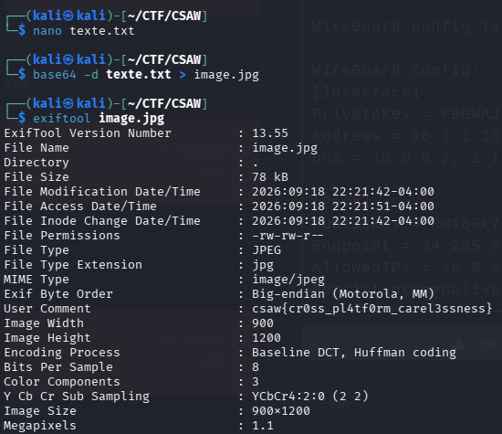

Le flag final est donc :

```text
csaw{cr0ss_pl4tf0rm_carel3ssness}
```

---

## Conclusion

La chaîne complète était approximativement :

```text
evidence_02.txt
    ↓
indice vers le PDF presque invisible
    ↓
evidence_01.pdf
    ↓
/fingerprint
    ↓
bot Discord
    ↓
ferryman_vt
    ↓
WhatsMyName
    ↓
Instagram
    ↓
acrostiche TOCKFERR
    ↓
X / @tockferr
    ↓
Geneva / @timepieces_ferr
    ↓
38fw78xp
    ↓
TinyURL
    ↓
paste.d4rk4shes.com
    ↓
Base64
    ↓
JPEG
    ↓
EXIF
    ↓
FLAG
```

Le défi mélangeait donc :

- analyse de fichiers ;
- stéganographie visuelle légère ;
- interaction avec un bot Discord ;
- username enumeration ;
- OSINT cross-platform ;
- analyse de relations entre comptes ;
- décodage Base64 ;
- inspection de métadonnées EXIF.

## Flag

```text
csaw{cr0ss_pl4tf0rm_carel3ssness}
```
